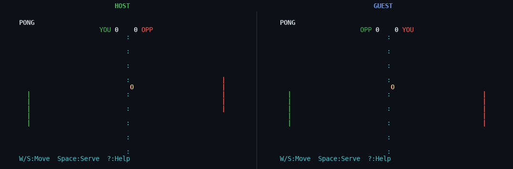
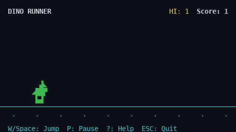
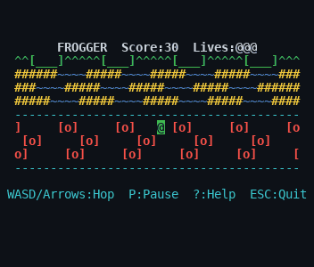
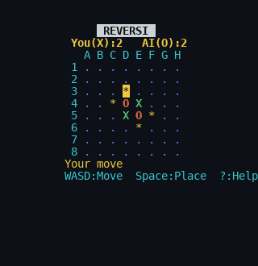
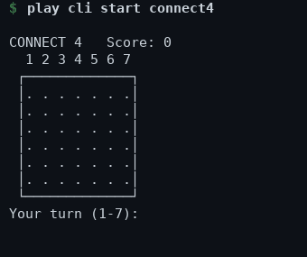

<div align="center">

# play

**Fourteen terminal games, and a friend to beat.**

One command. No setup. Runs on Linux, macOS, WSL, and Windows.

<p>


</p>

<br>

<table>
<tr>
<td align="center"></td>
<td align="center"></td>
</tr>
</table>

</div>

<br>

> **The hardest part of vibe coding is the waiting.** Your agents are off doing
> their thing, you have nothing to do, and the office laptop is locked down.
> So run a game in the terminal you already have open, and pull in a coworker
> over the LAN.

<br>

## Quick start

```bash
pip install terminal-games
```

```bash
play                 # open the menu
play snake           # jump straight into a game
play mp              # play a friend over the network
play list            # every game, with your high scores
```

That is the whole story. The games use Python's built-in `curses`; on Windows
the install adds `windows-curses` for you. Nothing else to install.

<br>

## Play with a friend

Three games go two-player over a local network, one hosts and the other joins
by IP. No account, no server, no configuration.

<div align="center">

<br>
<sub>The same Pong rally, from each player's screen</sub>
</div>

```bash
play mp              # or press M in the menu
```

Pick **Reversi**, **Connect Four**, or **Pong**, then **Host** or **Join**. The
host reads out an address like `192.168.1.5 : 8765`; the other player types it
in. Reversi and Connect Four are turn-based and rock-solid at any latency; Pong
is real-time and best on the same Wi-Fi.

<br>

## The games

<h3>Arcade</h3>
<table>
<tr>
<td width="50%" align="center"><br><b>Snake</b> &nbsp;·&nbsp; <code>play snake</code><br><sub>Eat, grow, and don't bite your tail.</sub></td>
<td width="50%" align="center"><br><b>Pac-Man</b> &nbsp;·&nbsp; <code>play pacman</code><br><sub>Clear the dots, dodge four hunting ghosts.</sub></td>
</tr>
<tr>
<td width="50%" align="center"><br><b>Dino Runner</b> &nbsp;·&nbsp; <code>play dino</code><br><sub>Jump the cacti, run forever.</sub></td>
<td width="50%" align="center"><br><b>Breakout</b> &nbsp;·&nbsp; <code>play breakout</code><br><sub>Bounce the ball, break every brick.</sub></td>
</tr>
<tr>
<td width="50%" align="center"><br><b>Space Shooter</b> &nbsp;·&nbsp; <code>play shooter</code><br><sub>Waves, power-ups, and bosses.</sub></td>
<td width="50%" align="center"><br><b>Flappy Bird</b> &nbsp;·&nbsp; <code>play flappy</code><br><sub>Flap through the gaps.</sub></td>
</tr>
<tr>
<td colspan="2" align="center"><br><b>Frogger</b> &nbsp;·&nbsp; <code>play frogger</code><br><sub>Cross the traffic and the river to the home bays.</sub></td>
</tr>
</table>

<h3>Puzzle</h3>
<table>
<tr>
<td width="50%" align="center"><br><b>Tetris</b> &nbsp;·&nbsp; <code>play tetris</code><br><sub>Stack, clear lines, level up. Ghost piece included.</sub></td>
<td width="50%" align="center"><br><b>2048</b> &nbsp;·&nbsp; <code>play 2048</code><br><sub>Slide and merge to the big tile.</sub></td>
</tr>
<tr>
<td width="50%" align="center"><br><b>Minesweeper</b> &nbsp;·&nbsp; <code>play mines</code><br><sub>Read the numbers, flag the mines. Three sizes.</sub></td>
<td width="50%" align="center"><br><b>Sokoban</b> &nbsp;·&nbsp; <code>play sokoban</code><br><sub>Push each box onto a target. Undo freely.</sub></td>
</tr>
</table>

<h3>Head to head <sub>(vs AI or a friend)</sub></h3>
<table>
<tr>
<td width="33%" align="center"><br><b>Pong</b> &nbsp;·&nbsp; <code>play pong</code></td>
<td width="33%" align="center"><br><b>Reversi</b> &nbsp;·&nbsp; <code>play reversi</code></td>
<td width="33%" align="center"><br><b>Connect Four</b> &nbsp;·&nbsp; <code>play connect4</code></td>
</tr>
</table>

<br>

## Controls

```
 WASD / Arrows   Move, aim, navigate
 Space           Jump · Hard drop · Launch · Fire · Serve · Place · Reveal
 W               Rotate (Tetris)
 F               Flag a cell (Minesweeper)
 U               Undo (Sokoban)
 R               Reset level (Sokoban) · Retry after game over
 P               Pause
 ? / H           In-game controls
 M               Multiplayer (menu) · T  Theme (menu)
 ESC / Q         Quit (progress is saved)
```

Space Shooter, Pong, and Minesweeper ask for a difficulty. Snake, Dino, and
Flappy speed up as you go; Tetris levels up. Quit any game and it resumes next
time you open it.

<br>

## Turn-based mode

For playing a move at a time in a chat or an editor, `play cli` runs the games
as plain text, no full-screen UI and no curses required.

<div align="center">

</div>

```bash
play cli start connect4    # also: snake, 2048, minesweeper
play 4                     # drop a disc in column 4
play show                  # reprint the board
play quit                  # end the game
```

<br>

## Built honestly

One file, `play.py`, with a dependency-free test suite you can run yourself:

```bash
python tests/test_games.py     # a headless fuzz, save/load, network, and a
                               # regression test behind every fix
```

Every GIF in this README is rendered straight from the game code, so what you
see is what you get.

<br>

## Contributing

Pull requests welcome. A new game is a subclass of `Game` added to `_GAMES`; a
new level or theme is a few lines. Please run the tests first.

## License

[MIT](LICENSE)
